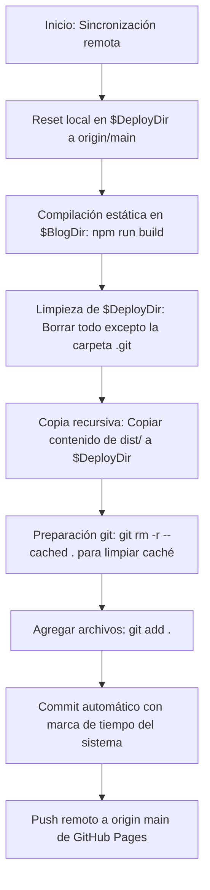

# Especificación Técnica: Build & Deploy Pipeline (Compilación y Despliegue)

Esta especificación detalla el proceso completo de compilación estática del blog, la optimización posterior a la compilación y los flujos de integración y despliegue a producción en GitHub Pages utilizando herramientas de automatización local (PowerShell).

---

## 1. Secuencia de Compilación Estática (Static Site Generation)

El sitio funciona como una aplicación estática y se genera mediante la ejecución del script del sistema de paquetes:

```bash
npm run build
```

El ciclo de ejecución de la compilación realiza las siguientes etapas ordenadas:
1.  **Astro Compiler**: Compila y pre-renderiza todas las páginas dinámicas y estáticas mapeadas en `src/pages/` utilizando los datos de las colecciones de contenido (`src/content/`).
2.  **Vite Bundler**: Empaqueta, minifica y optimiza los recursos de JavaScript, React y procesa Tailwind CSS v4 para generar estilos CSS altamente eficientes.
3.  **Astro Sitemap & RSS Integrations**: Genera los feeds del blog y los archivos XML iniciales del sitemap (`sitemap-index.xml`, `sitemap-0.xml`) en la carpeta `/dist`.
4.  **Script de Aplanado de Sitemap (`flat-sitemap.js`)**: Una vez finalizado el build de Astro, se ejecuta automáticamente el comando `node scripts/flat-sitemap.js`. Este script realiza las siguientes operaciones:
    *   Comprueba la existencia del sitemap temporal `/dist/sitemap-0.xml`.
    *   Renombra el archivo a `/dist/sitemap.xml` para garantizar la compatibilidad clásica con los rastreadores web.
    *   Elimina de forma segura `/dist/sitemap-index.xml` para evitar que Google Search Console se confunda al indexar múltiples sitemaps redundantes en un blog de un solo hilo.

---

## 2. Flujo de Automatización de Despliegue (`scripts/deploy.ps1`)

Para desplegar los cambios a GitHub Pages de manera robusta y evitar conflictos de sincronización, se utiliza un script de automatización en PowerShell localizado en `scripts/deploy.ps1`.

### 2.1. Configuración de Rutas del Script
*   **`$BlogDir`**: Ruta absoluta del código fuente de desarrollo del blog (`C:\Users\yamilayma\Desktop\blog`).
*   **`$DistDir`**: Directorio donde Astro coloca los archivos compilados estáticos listos para producción (`$BlogDir\dist`).
*   **`$DeployDir`**: Directorio absoluto del repositorio de producción externo clonado e independiente (`C:\Users\yamilayma\Desktop\blog_dist`), el cual está directamente enlazado a la rama de distribución pública de GitHub Pages.

### 2.2. Secuencia Operativa Paso a Paso del Script

Cuando se ejecuta el script de despliegue (`npm run deploy`), la automatización de PowerShell ejecuta ordenadamente las siguientes fases bajo control estricto de errores (`$ErrorActionPreference = "Stop"`):



1.  **Fase 1: Sincronización del Repositorio de Producción**:
    *   El script se posiciona en el directorio `$DeployDir`.
    *   Ejecuta `git fetch origin` para descargar los últimos cambios remotos.
    *   Ejecuta `git reset --hard origin/main` para forzar que el repositorio de deploy local coincida con la nube (importante si bots automatizados o acciones de GitHub han escrito en la rama).
2.  **Fase 2: Compilación de los Nuevos Cambios**:
    *   El script se posiciona en `$BlogDir`.
    *   Ejecuta `npm run build` (que compila la web y aplana el sitemap).
3.  **Fase 3: Limpieza y Preparación de la Carpeta de Deploy**:
    *   El script regresa a `$DeployDir`.
    *   Utiliza comandos de PowerShell para remover recursivamente todos los archivos y subcarpetas contenidos en `$DeployDir` **excepto la carpeta interna `.git/`**, la cual resguarda el historial de control de versiones y el enlace remoto.
4.  **Fase 4: Copia de los Nuevos Archivos Generados**:
    *   El script copia todo el contenido del directorio compilado `$DistDir` hacia `$DeployDir` de manera recursiva y forzada.
5.  **Fase 5: Registro y Despliegue en Control de Versiones**:
    *   **Limpieza de Caché de Git**: Ejecuta `git rm -r --cached . -q` para purgar el índice. Esto es crítico en sistemas operativos Windows para evitar errores y conflictos de casing (mayúsculas y minúsculas) al subir archivos a servidores Linux.
    *   **Adición**: Ejecuta `git add .` para agendar todos los archivos copiados.
    *   **Commit de Despliegue**: Elabora un commit automático adjuntando la marca de tiempo exacta del sistema (`Deploy Manual: AAAA-MM-DD HH:MM`). Si no hay cambios detectados con respecto al último despliegue, el script captura silenciosamente el evento para finalizar sin errores.
    *   **Empuje de Versión**: Ejecuta `git push origin main` para publicar los cambios en la rama productiva de GitHub Pages.
    *   El blog se compila y se sirve públicamente bajo la URL: `https://yamilayma.github.io/`.
