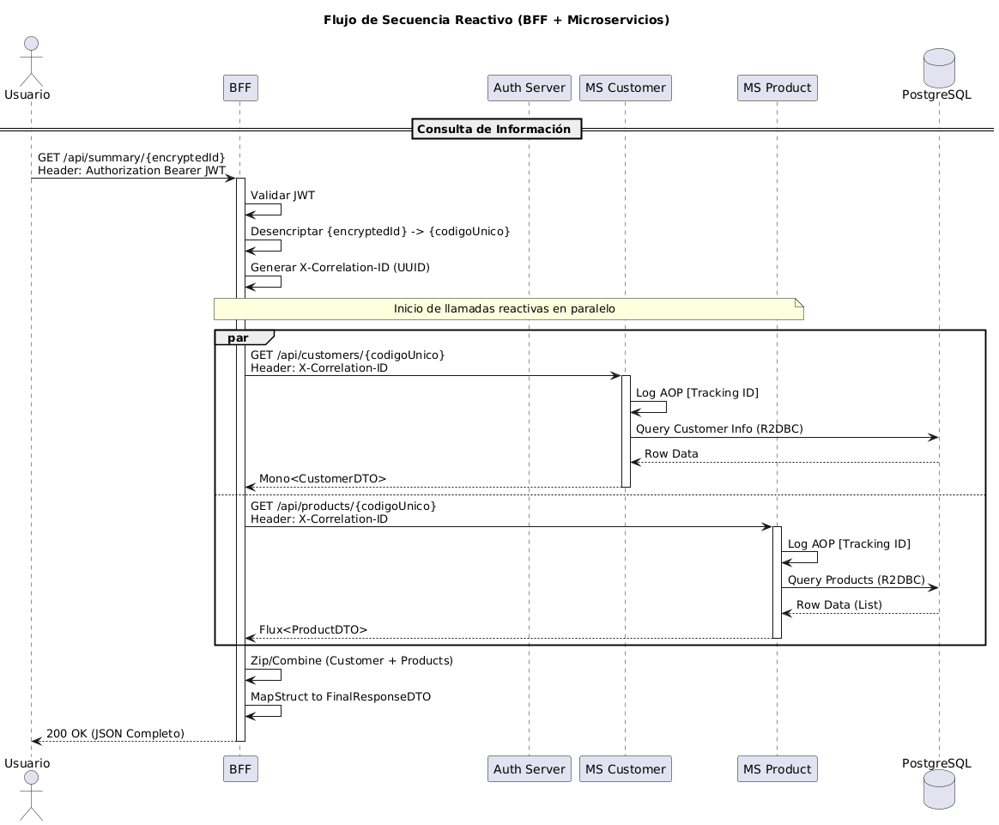
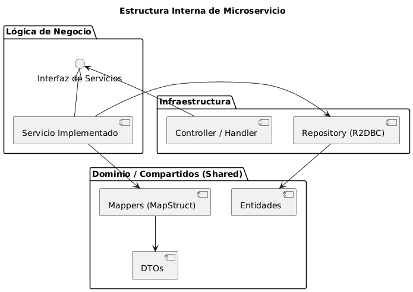
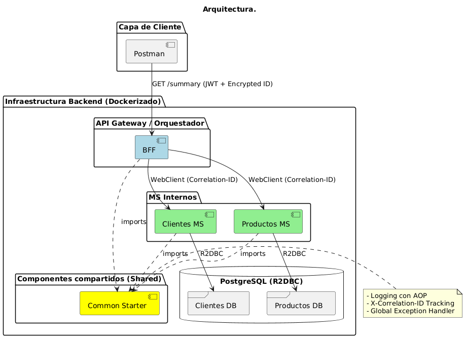

Últimamente me encontré en la necesidad de explicar cómo funcionaban unos servicios que estaba construyendo, y la verdad, dibujar cajitas a mano me tomaba demasiado tiempo.

Me gusta usar [PlantUML](https://plantuml.com/es/) porque te permite hacer diagramas como si escribieras código _(diagrams-as-code)_, lo cual es genial para versionarlo en Git.

En mi búsqueda por agilizar esto, empecé a probar algunos *prompts* con IA para que me generara la estructura base y yo solo tuviera que refinar detalles. 
Me ahorró bastantes horas y quería compartírselos por si están en las mismas.

Aquí les dejo 3 escenarios comunes y el prompt que uso para cada uno.

---

### 1. Diagrama de Secuencia (Ideal para aprender flujos)
Este lo usé cuando quería visualizar (o explicar) cómo interactúa el Frontend con el Backend en una funcionalidad específica. Incluso tengo presente utilizarlos más a menudo en README.md para proyectos futuros.

**Prompt:**
```markdown
"Actúa como un experto en UML. Analiza el código del controlador y el servicio que te voy a pasar.
Genera un diagrama de secuencia en PlantUML que muestre el flujo 'happy path'.
Ojo: Como estoy usando Spring WebFlux (Reactive), representa los flujos asíncronos correctamente. Incluye la validación del token en el BFF y las llamadas a los microservicios internos."
Gracias por tu trabajo.
```

---



### 2. Diagrama de Componentes
Cuando el sistema crece o trabajamos modular, necesitamos ver la comunicación o conocer la estructura de cada uno. 
Este prompt me sirve para mapear qué servicio habla con cuál o como están compuestos los módulos.

**Prompt:**
```markdown
"Analiza la estructura de este microservicio.
Quiero un diagrama de componentes que muestre las capas internas (Controller, Service, Repository, DTOs).
Agrupa los elementos por su responsabilidad (Infraestructura, Dominio, Lógica) y muestra las dependencias entre ellos. Usa una dirección de izquierda a derecha."
Gracias por tu trabajo.
```



---

### 3. Modelo C4 (Arquitectura)
Este es un poco más formal, pero muy útil para documentación técnica de alto nivel como para visualizar las tecnologías con las que se trabaja o un mapa de todo.
Aquí te recomiendo describir las tecnologías y su función en tu proyecto o puedes modificarlo para que vea tus carpetas si usas herramientas como **Antigravity** / **Claude Code**

**Prompt:**
```markdown
"Genera un diagrama de Arquitectura (estilo C4 Container) para el sistema completo.
Tengo un API Gateway (BFF) que orquesta llamadas a dos microservicios (Clientes y Productos).
Ambos se conectan a una base de datos <X>.
Incluye las tecnologías usadas (Spring Boot, Docker, R2DBC) en las cajas."
Gracias por tu trabajo.
```



---

### ¿Cómo visualizarlo?
Si no tienen instalado nada en local, pueden pegar el código resultante en [PlantUML Editor](https://editor.plantuml.com/) o usar la extensión de PlantUML en VSCode.

Espero que estos prompts les sirvan de base. Al final, la IA nos da la estructura, pero el criterio técnico lo ponemos nosotros.

¡Un saludo! 👋